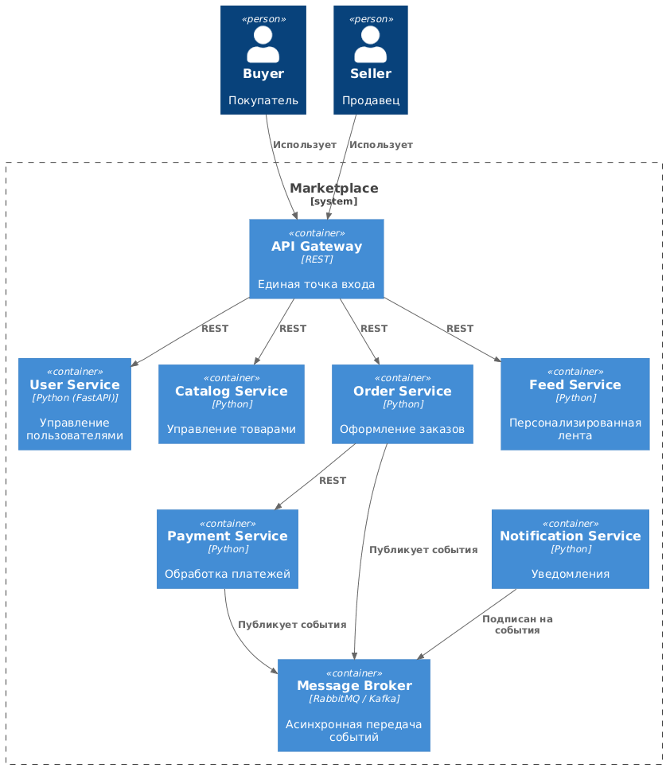

# Marketplace Architecture Project

## 1. Описание проекта

Этот проект представляет архитектуру цифрового маркетплейса, на котором продавцы размещают товары, а покупатели оформляют заказы.  
На этом этапе реализована только архитектура и один работающий сервис (`User Service`) без бизнес-логики.

Маркетплейс включает следующие функции:

- Управление пользователями (покупатели и продавцы)  
- Управление товарным каталогом  
- Оформление заказов  
- Расчёт и учёт платежей  
- Отправка уведомлений  
- Персонализированная лента товаров  

---

## 2. C4 Container диаграмма



**Описание:**  

- **API Gateway** – единая точка входа, маршрутизирует REST-запросы к сервисам  
- **User Service** – управление пользователями, регистрация, роли  
- **Catalog Service** – управление товарами, описания, категории, цены  
- **Order Service** – оформление заказов, состояние заказов  
- **Payment Service** – обработка платежей, интеграция с платёжными системами  
- **Notification Service** – отправка уведомлений о заказах и платежах  
- **Feed Service** – персонализированная лента и рекомендации  

**Взаимодействие:**  

- Синхронное: REST API через API Gateway  
- Асинхронное: события между Order Service, Payment Service и Notification Service

---

## 3. Домены маркетплейса и зоны ответственности

| Домены     | Зона ответственности |
|------------|--------------------|
| User       | Управление пользователями, регистрация, роли |
| Catalog    | Управление товарами, описание, категории, цены |
| Order      | Создание и отслеживание заказов, состояния |
| Payment    | Обработка платежей, интеграция с платёжными системами |
| Notification | Отправка уведомлений о заказах и платежах |
| Feed       | Персонализированная лента товаров, рекомендации |

---

## 4. Распределение доменов по сервисам

| Сервис         | Домены, которыми владеет | Логика распределения |
|----------------|-------------------------|--------------------|
| User Service   | User                    | Изолированное управление пользователями |
| Catalog Service | Catalog                | Управление товарами отдельно от других сервисов |
| Order Service  | Order                   | Критичен к корректности, должен быть независимым |
| Payment Service | Payment                | Обрабатывает платежи, требует отдельной базы |
| Notification Service | Notification       | Асинхронная обработка уведомлений |
| Feed Service   | Feed                    | Персонализация, нагрузка на чтение, отдельный сервис |

**Логика:** Каждый сервис управляет своим доменом, чтобы изолировать данные и зоны ответственности, облегчить масштабирование и сопровождение.

---

## 5. Границы владения данными

| Сервис             | Данные, которыми владеет | Ответственность |
|-------------------|-------------------------|----------------|
| User Service       | Пользователи, роли, регистрация | Управление пользователями |
| Catalog Service    | Товары, категории, цены | Управление каталогом |
| Order Service      | Заказы, статусы заказов | Создание и отслеживание заказов |
| Payment Service    | Платежи, статусы транзакций | Обработка платежей |
| Notification Service | Логи уведомлений, события | Отправка уведомлений |
| Feed Service       | История просмотров, рекомендации | Генерация персонализированной ленты |

**Взаимодействия:**

- Синхронное (REST API): API Gateway ↔ Сервисы, Order Service ↔ Payment Service  
- Асинхронное (события): Order Service / Payment Service → Notification Service

**Особенность:** нет разделяемых баз данных между сервисами — каждый сервис владеет своей базой.

---

## 6. Альтернативные варианты декомпозиции

**Вариант 1: Микросервисная архитектура**  
- Каждый домен в отдельном сервисе  
- Легко масштабировать, изолированы данные, поддержка событийной модели  

**Вариант 2: Монолит**  
- Все домены в одном приложении  
- Проще запускать, меньше инфраструктуры  
- Сложнее масштабировать и изолировать данные  

---

## 7. Trade-off’ы вариантов

| Вариант          | Плюсы | Минусы |
|-----------------|-------|--------|
| Микросервисы    | Изоляция данных, масштабируемость, независимое обновление сервисов, гибкая архитектура | Более сложная инфраструктура, требуется Docker / оркестрация |
| Монолит         | Простота развёртывания, меньше компонентов, проще для студенческого проекта | Сложно масштабировать, риски при изменении одного домена, сложно поддерживать границы владения данными |

**Trade-off:** Микросервисы сложнее в настройке, но полностью соответствуют требованиям кейса — изоляция данных, границы ответственности, асинхронные уведомления, масштабируемость.

---

## 8. Обоснование финального выбора

Выбран **вариант микросервисной архитектуры**.

**Причины:**

- Подходит под доменную модель маркетплейса (каждый сервис управляет своим доменом)  
- Обеспечивает изоляцию данных (нет shared DB)  
- Легко масштабировать части системы независимо  
- Поддерживает асинхронную обработку уведомлений и событий  
- Соответствует современным подходам для маркетплейсов

> Несмотря на дополнительную сложность инфраструктуры, микросервисная архитектура лучше соответствует требованиям кейса.

---

## 9. Инструкция запуска проекта

**1. Убедитесь, что установлены Docker и Docker Compose:**

```bash
docker --version
docker-compose --version

# Проверка health-check
curl http://localhost:8000/health
# Должен вернуть {"status":"OK"}
